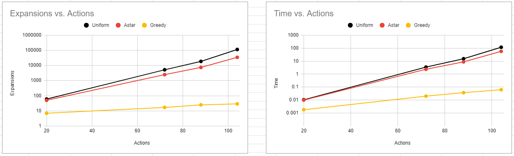

# Experiment with the planning algorithms
- Yoon-gu Hwang
- `yz0624@gmail.com`

# Overview
This is a report file for the planning algorithms in AI Nanodegree. In this project, I did an experiment eleven search algorithms on four problems.

# Results
## Air Cargo Problem 1

|Search algorithm|Actions|Expansions|Plan length|Time elapsed (sec)|Optimality|
|---|---:|--:|--:|--:|---|
|breadth first search|20|43|6|0.0061|True|
|depth first search |20|21|20|0.0033|False|
|uniform cost search |20|60|6|0.0106|True|
|greedy best first with unmet goals|20|7|6|0.0018|True|
|greedy best first with levelsum|20|6|6|0.3008|True|
|greedy best first with maxlevel|20|6|6|0.0906|True|
|greedy best first with setlevel|20|6|6|0.9476|True|
|A* with unmet goals|20|50|6|0.0100|True|
|A* with levelsum|20|28|6|0.7552|True|
|A* with maxlevel|20|43|6|0.3650|True|
|A* with setlevel|20|33|6|2.4104|True|

## Air Cargo Problem 2
|Search algorithm|Actions|Expansions|Plan length|Time elapsed (sec)|Optimality|
|---|---:|--:|--:|--:|---|
|breadth first search|72|3343|9|2.0407|True|
|depth first search |72|624|619|3.1250|False|
|uniform cost search |72|5154|9|3.4519|True|
|greedy best first with unmet goals|72|17|9|0.0201|True|
|greedy best first with levelsum|72|9|9|5.9593|True|
|greedy best first with maxlevel|72|27|9|3.9277|True|
|greedy best first with setlevel|72|9|9|18.9674|True|
|A* with unmet goals|72|2467|9|2.3587|True|
|A* with levelsum|72|357|9|156.5190|True|
|A* with maxlevel|72|2887|9|369.4994|True|
|A* with setlevel|72|1037|9|1437.0363|True|

## Air Cargo Problem 3
|Search algorithm|Actions|Expansions|Plan length|Time elapsed (sec)|Optimality|
|---|---:|--:|--:|--:|---|
|breadth first search|88|14663|12|11.0938|True|
|depth first search |88|408|392|1.1883|False|
|uniform cost search |88|18510|12|15.2568|True|
|greedy best first with unmet goals|88|25|15|0.0371|False|
|greedy best first with levelsum|88|14|14|13.6434|False|
|greedy best first with maxlevel|88|21|13|5.9953|False|
|greedy best first with setlevel|88|35|17|96.3056|False|
|A* with unmet goals|88|7388|12|8.7216|True|
|A* with levelsum|88|369|12|247.5065|True|
|A* with maxlevel|88|9580|12|2240.8644|True|
|A* with setlevel|88|3423|12|6561.5228|True|

## Air Cargo Problem 4
|Search algorithm|Actions|Expansions|Plan length|Time elapsed (sec)|Optimality|
|---|---:|--:|--:|--:|---|
|breadth first search|104|99736|14|99.6841|True|
|depth first search |104|25174|24132|-|False|
|uniform cost search |104|113339|14|117.2805|True|
|greedy best first with unmet goals|104|29|18|0.0624|False|
|greedy best first with levelsum|104|17|17|24.7534|False|
|greedy best first with maxlevel|104|56|17|17.1821|False|
|greedy best first with setlevel|104|107|23|410.3759|False|
|A* with unmet goals|104|34330|14|56.4792|True|
|A* with levelsum|104|1208|15|1365.6180|False|
|A* with maxlevel|104|62077|14|-|True|
|A* with setlevel|104|22606|14|-|True|

# Analysis
The complexity of problem is getting increased from Problem 1 to Problem 4. Thus, Problem 4 is the most complex one. The simplest one is Problem 1.
The more complex problem becomes, the more possible actions problem has. Problem 1 has 20 actions and problem 4 does 104 actions. I can notice that via the prescribed tables and left of chart, the number of expansions increases exponentially repsect to possible actions. Expansions of all uninformed algorithms and A* algorithms are increased exponentially as actions increase. However, greedy best first algorithm has linearity in the relation between expansions and actions. Uniform cost search algorithm produces the most expansions in uninformed algorithms and expansions of A* with max level algorithm dramatically increases among heuristic ones.

	 
	<b>Figure</b> Expansion against the number of Actions

The result of elapsed time is very similar with the previous result (expansions). Time of uninformed algorithms and A* algorithms are exponentially increased. But search time of greedy best first algorithms has the lineary relation against actions. The right chart in the Figure shows the mentioned result.

The optimality column is included to each table of problem. Optimality means that the plan length is optimal for each algorithm. But DFS has no optimal plan length for all problems. BFS and uniform cost search algorithms have optimal plan length for all problems. A* algorithms  are optimal except level sum heuristic. Greedy best first algorithms have optimal plan length in problem 1 and 2 but they are not optimal with problem 3 and 4.

## Result Answers
- **Which algorithm or algorithms would be most appropriate for planning in a very restricted domain (i.e., one that has only a few actions) and needs to operate in real time?**

	 Greedy best first with unmet goals algorithm is the fastest while it has no optimal plan length. Thus, I think it is the most appropriate algorithm in a very restrict domain.

- **Which algorithm or algorithms would be most appropriate for planning in very large domains (e.g., planning delivery routes for all UPS drivers in the U.S. on a given day)?**

	A* with unmet goals is the most appropriate for planning in very large domain. It has the optimal path length for all problems, and its search speed is quite fast.

- **Which algorithm or algorithms would be most appropriate for planning problems where it is important to find only optimal plans?**

	A* with unmet goals will be the most appropriate to find only optimal plans. It provides the optimal plan for all problems and it is fast than other optimal algorithms.
